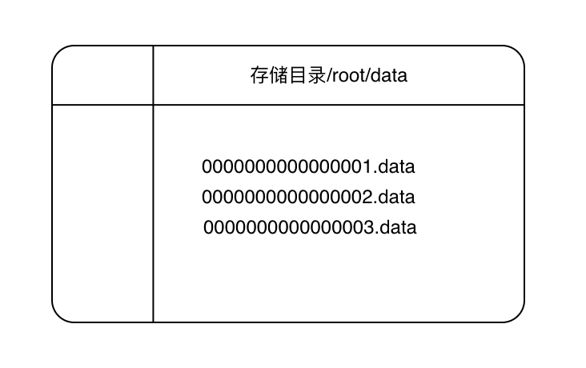

## 分布式选举同步数据中心

数据，同步，选举，存储这些模块互相之间完全解耦合，这次试验以最常见的聊天场景为例，实验数据的传输，同步，存储，以及多服务节点的选举，在这一系列过程中如何保证最关键的数据不丢失，顺序不错乱，服务高可用才是最关键的。

## 一阶段

OSMC 单服务节点，多客户端节点时期

服务器为单节点接收所有请求，客户端支持多节点，即可打开多个会话终端统一连接共同的服务器。

连接问题

采用Netty实现服务端和客户端：

服务端保存所有客户端的会话状态，接收已连接的客户端消息请求，再转发至会话组进行统一广播发送，针对私聊类型的消息转发至指定名称的客户端，服务端即支持单点与广播模式。

客户端终端：项目应提供独立jar包启动后直连服务端，该模式仅为校验连接效果，以广播形式进行消息发送，内部保存连接管道信息，以阻塞的形式不断发起终端输入。

客户端网页：考虑本地启动jar包的方式不够便捷，在单独web服务中添加连接服务端的逻辑，每个请求会话视为独立客户端，也就是每个网页都是独立的客户端，该模式下可以支持广播与单点发送，但仅用来提升体验，无复杂逻辑。

存储问题

在不依赖其他存储数据库的情况下，数据内容由服务自身来支持，存储方案采用本地+内存的方式，本地做全量数据的存储，根据日期来分块存储，而内存考虑到空间问题，并且宕机易丢失的情况，通过时间+数据量两种条件来判断，达到任一条件立即落盘存储。

与存储相关的场景：

初始化启动：需要显示部分聊天记录，加载存储目录中文件列表，按照逆序方式获取定量数据块。

正常运行：达到落盘条件即存入当日的本地数据块

注意点：在0点时要进行一个强制数据存储，防止数据跨时间维度存储

内存结构：使用单列表数据结构来模拟环形列表，存储过程中采用头部指针与保存点的概念，使得所有数据操作只在此列表中进行，固定环形列表大小，存储数据超过限制大小后覆盖最久存储的数据，在覆盖之前同时将数据存储到磁盘文件中。

环形列表存储过程：

假设列表大小为100，初始化时，保存点与头部指针均为0

服务端启动时将本地已保存到文件中的数据加载到环形列表中，因为该数据已经存储到磁盘中，加载内存只是为刚连接的客户端提供一些历史聊天记录，所以不能将该数据反复存入磁盘，会造成数据冗余，在加载固定条数数据后，保存点和头部指针均等于该数据量值。

正常运行期间：新增数据不断存入环形列表，头部指针随数据量增加而递增，保存点固定不变，当头部指针值递增至列表最大值时，触发落盘机制将保存点到头部指针列表中的数据全部保存，同时将头部指针和保存点归零。

定时任务运行期间： 在定时任务触发时，保存点可能为0，也可能大于0，而头部指针可能远小于环形列表最大值，此时只存储保存点到头部指针之间的子列表数据，保存完毕后将保存点值修改为头部指针的值，这里不将头部指针设置为0，是为了能读取最近存储的数据。

二阶段

MSMC 多服务端节点多客户端节点时期

缓解单节点服务端的访问压力，提高服务端整体处理能力，不再采用一对多模式，客户端提前配置好一个或多个服务端节点连接地址，在启动时随机分配服务器进行处理，客户端除此之外与1.0版本无差异，只需保证消息的正常发送接收，主要的复杂度体现在服务端，服务端需配置所有服务节点信息，在启动时连接其他服务节点并保存该信息，这里需要开辟新的端口号用于服务节点之间的通信传输，在服务端接收到客户端发送的数据后，先将这条数据广播至连接该服务节点的所有客户端，再将数据发送给其他服务端节点，其他数据节点接收到数据后再广播到本节点下的所有客户端，有点类似于gosip传染病协议，这时会面临跨服务端节点的私聊请求，所以要在发送的消息体中保存ServerId来判断要转发的服务节点。至此每个服务端都全量保存所有数据，存储功能沿用1.0版本即可。如果当前客户端连接的服务器发生宕机，最好可以加入重连机制，再已配置连接地址池中重新选择一个地址进行连接。

增加分布式handler，启动时主动连接配置文件中所有的服务器节点，保存连接会话池，在启动时考虑其他服务器为启动的可能，可配置重试次数，等待间隔时间。当本服务器节点收到客户端消息，通过分布式handler将数据全部广播出去。

弊端：服务器需要创建多个连接来和其他服务器通信，如果有服务器节点启动缓慢或者中途断开，1.需要判断心跳来重连，2.会丢失这期间广播的数据，造成有的节点并非全量数据。

处理方式可以加入反馈机制，已接收到广播消息的服务器节点发送ack确认，在超时未收到回馈时，如果这时目标节点已经断连就不重发，未断连则根据配置的重试次数一直重发直到收到反馈，不再重发的节点，保存到特殊的死信队列中，待之后连接成功后将队列中数据发送出去。

这里可以参考tcp协议设计。

三阶段

OMMF 一主多从分布式服务端节点时期

正式引入选举机制，解决2.0版本存在大量数据分发的问题，当服务端节点增加，数据传输量呈指数级增加，会大量占用网络带宽，对正常服务请求处理造成阻塞。选举出主节点来控制数据处理，所有的写请求由主节点操作，从节点只负责写请求的转发和读请求的响应，这意味着如果客户端连接的是主节点则直接在进行数据的发送和接收，如果连接的从节点，则需要把数据先转发给主节点，主节点会把从节点转发的数据进行保存然后分发至其他从节点，从节点中保存同步的消息队列，定时或定量将队列中的消息发送给该节点下所有客户端。

四阶段

MMYS 节点平等分布式服务端节点时期

解决一主多从情况下，主节点容易成为整个集群的瓶颈，增加节点只能加重主节点的写压力，无法提升集群整体吞吐量。

